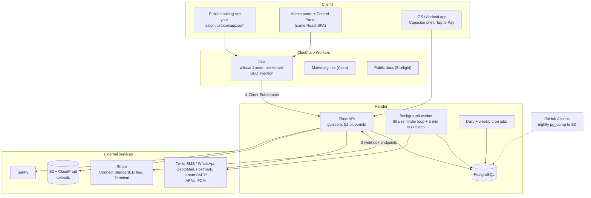

# JustBook — availability engine

**JustBook** is a multi-tenant appointment-booking platform for salons and similar
businesses: each business gets a branded public booking site on its own subdomain, a
phone-first admin portal, and an iOS/Android app for the front desk; a superadmin
Control Panel runs plans, billing and tenants. It launched in August 2026, is live in
production at [justbookapp.com](https://justbookapp.com) and open for signup, and does
not have customers yet. I designed, built and operate all of it as founder and sole
developer.

**Why only this part is public.** JustBook is a commercial product with customer data
and payment flows, so its repository is private. This repository contains the one piece
that is both self-contained and the most algorithmically interesting — the code that
decides *which times can be booked* — published so there is real production code to
read rather than a description of it.

What is in here:

| Path | What it is | Origin |
|---|---|---|
| [`app/utils/availability_engine.py`](app/utils/availability_engine.py) | The engine: month grid + day slot generator | **Byte-for-byte the file in the product repository** |
| [`app/utils/booking_rules.py`](app/utils/booking_rules.py) | Booking window / increment rules | **Byte-for-byte the file in the product repository** |
| [`app/utils/appointment_helpers.py`](app/utils/appointment_helpers.py) | Working hours, holds, the write-path conflict check and the booking lock | **Verbatim excerpt** (10 functions of a ~1,700-line module) |
| [`tests/`](tests/) | 63 tests | Ported from production; every adaptation is marked in the file |
| [`app/__init__.py`](app/__init__.py), [`app/models/models.py`](app/models/models.py), [`tests/conftest.py`](tests/conftest.py), [`tests/factories.py`](tests/factories.py), [`examples/demo.py`](examples/demo.py) | App shell, slim table definitions, harness, example | Written for this repository |

The engine imports `db`, seven ORM models and two helpers from the application. Those
imports resolve here against a minimal shell with the same module paths, which
is why the engine file needed no edits. All data in tests and the example is synthetic.

- [Run it](#run-it)
- [System overview — all of JustBook](#system-overview--all-of-justbook)
- [Stack](#stack)
- [The availability engine in depth](#the-availability-engine-in-depth)
- [Key engineering decisions](#key-engineering-decisions)
- [What I'd do differently](#what-id-do-differently--what-i-learned)

---

## Run it

Developed and tested on Python 3.14. No services required.

```bash
python3 -m venv .venv && . .venv/bin/activate
pip install -r requirements.txt

pytest                     # 61 pass, 2 skipped (Postgres-only), < 1 s on SQLite
python examples/demo.py    # month grids, one day's slots, a DST weekend, the write guard
```

The two skipped tests prove the booking lock against a real second database
connection. To run them, point the suite at any empty Postgres database whose name
ends in `_test` (the harness refuses anything else, the same guard production uses):

```bash
pip install psycopg2-binary
createdb engine_test
TEST_DATABASE_URL=postgresql://localhost/engine_test pytest    # 63 pass
```

`examples/demo.py` prints, for a New York branch in a March that contains the DST
change: a month grid for one stylist and for "any stylist", one day's slot list with
each gap explained (buffer, cancelled appointment, another customer's live hold), the
first slot either side of the clock change (`-05:00` → `-04:00`), and the write-path
guard agreeing with the read path.

---

## System overview — all of JustBook



**Backend.** A Flask 3.1 application factory; routes are split into 52 blueprints
across about 100 route modules, all under `/api`. SQLAlchemy models (127 of them) and
130 Alembic migrations built on a single replayable baseline, so every database —
development, each test run, staging, production — is created the same way:
`alembic upgrade head`. A test fails the build if the models and the migrations
disagree, or if there is more than one migration head.

**Frontend.** One React 19 + Vite SPA serves three surfaces: the public booking flow,
the admin portal (about 100 admin pages, phone-first, tables collapse to cards at 640 px)
and the superadmin Control Panel. State is React Context; there is no Redux. The same
bundle runs inside a Capacitor shell as the iOS/Android app, where it switches to a
hash router and adds native push, passkeys, a barcode scanner and Stripe Terminal
(card readers and Tap to Pay). The design system is owned — no Bootstrap or component
library — and every colour is derived from each tenant's palette through CSS tokens.

**Multi-tenancy and isolation.** One database, a `tenant_id` on every tenant-owned
row. The tenant is resolved per request from, in order, a `?subdomain=` query
argument, an `X-Client-Subdomain` header the SPA attaches, or the request host.
Inside a tenant, staff are scoped to their assigned branches by one helper module
that every list, finance and appointment route calls; admins are tenant-wide. Two
things keep this from regressing: every query that loads a tenant-owned row filters
by tenant (never by id alone — a cross-tenant delete was found and fixed in an IDOR
sweep), and a test parses every route with `ast` and fails if any endpoint lacks an
auth decorator, an in-body auth check, or an entry in a reviewed allowlist of
deliberately public paths.

**Auth.** Staff sessions are JWTs with sliding renewal (a fresh token is returned in
a response header past half-life) and server-side revocation through a per-user
token version. Tenant admins can add a second factor — one-time code over a channel
they pick, TOTP, a passkey, or recovery codes. Customers sign in with a 6-digit
one-time code and carry a separate token in a separate header. Control Panel login
always requires an emailed code and deliberately bypasses the tenant messaging
configuration. Permissions are 16 coarse umbrellas granted to roles; three of them
are "override" permissions, also grantable per user, that gate *deviating* from
policy (refunds, pricing, scheduling) rather than the base action.

**Error contract.** Every non-2xx response is
`{"error": <human sentence>, "code"?: <UPPER_SNAKE>, "details"?: {field: message}}`.
The 181 codes live in one Python registry; a script generates the frontend constants
from it, and a test fails if the generated file is stale or if any route puts a
machine code where the human sentence belongs. Global handlers guarantee that no
exception reaches a client as an HTML 500 or leaks `str(e)`. On the frontend exactly
one helper may turn an axios error into text, a lint script enforces that, and the
frontend branches on `code`, never on the sentence.

**Payments.** Tenants connect their own Stripe account (Connect *Standard*, onboarded
with Account Links); customer payments are direct charges on the tenant's account.
JustBook's own subscription billing is a separate money path with its own webhook
endpoint and signing secret. Webhook handlers are idempotent because Stripe
redelivers, and because one checkout can be processed by three handlers
(`checkout.session.completed`, `payment_intent.succeeded`, and the client's verify
call): the exactly-once guard lives *inside* each money helper, keyed on the
appointment id or the payment intent id, not at the call sites. Loyalty points and
package uses are only spent when an appointment reaches `Booked`, so an abandoned
checkout leaves a customer's balance untouched. Tax is computed by JustBook
(branch override → tenant default) and sent to Stripe as tax-inclusive.

**Background jobs.** No Celery or queue. One always-on worker boots the app once and
loops every 60 seconds to send due reminders, and every 5 minutes runs a batch of
cutoff-query tasks (pending-deposit nudges and expiries, scheduled broadcasts,
waitlist backfill, walk-in hold release). A daily cron runs about 20 sweeps (expiries,
rollups, retention purges, renewal reminders) and a weekly one reconciles storage.
Every task selects "everything due as of now", so a restart delays work but never
drops it, and a single sequential loop cannot double-send.

**Notifications.** Whether a message may be sent, and on which channels, is decided
in one module as a five-level cascade: tenant capability (plan + credentials) → global
channel toggles → per-template toggle → the recipient's own preference → a one-time
code exception that overrides preference. The cascade is written as pure functions so
it is unit-tested without a database. One executor performs the channel fan-out for
every customer-facing send; it replaced eleven hand-rolled loops that disagreed with
each other. Email goes through ZeptoMail (transactional), Postmark (marketing, on a
separate sending subdomain) or a tenant's own SMTP; SMS and WhatsApp through Twilio,
with WhatsApp restricted to pre-approved templates; push goes straight to APNs for
iOS and through FCM for Android.

**Deployment and hosting.** The API, worker, cron jobs and PostgreSQL run on Render.
The three web properties are Cloudflare Workers: the SPA Worker sits on a wildcard
route, runs before static assets, and injects per-tenant SEO tags into `index.html`;
the API hostname is DNS-only and never passes through a Worker. Uploads live in a
private S3 bucket behind CloudFront. There are two long-lived branches: `main`
deploys to a full staging mirror (its own database, Stripe sandbox, bucket and
domain, behind basic auth enforced in the Worker), and `production` deploys to
production and only moves by an explicit `git push origin main:production`.
Migrations run as a pre-deploy command, so a failed migration blocks the release.
Dropping a column is always two deploys, because during a deploy the old code and
the new schema are briefly live together.

**CI.** There is one GitHub Actions workflow, and it is not a test runner: a nightly
`pg_dump` of production to a versioned S3 bucket, run off-platform on purpose, with
an IAM key that can write but not delete. The quality gates run elsewhere: guard
scripts are invoked from inside the pytest suite (error contract, generated-code
parity, route-guard audit, migration/model drift, doc-map integrity); `npm run lint`
chains ESLint with 13 custom scripts (no hard-coded colours, no Bootstrap, one
spinner, one error reader, safe-area tokens, …); and a pre-push hook refuses to push
a backend that does not byte-compile and refuses to push `production` without an
explicit flag.

**Testing.** About 340 backend test files (pytest, against real PostgreSQL), about 270
frontend test files (Vitest + Testing Library), and 64 Playwright specs in 20 suites
that run at desktop, phone and iOS-WebKit sizes with axe accessibility checks, plus
k6 load scripts. Each backend test run creates its own database
(`justbook_p<pid>_test`), builds it from migrations, and drops it afterwards, so
concurrent runs cannot collide; the harness refuses to touch any database whose name
does not end in `_test`.

**Docs.** One `docs/` tree: architecture, per-feature flow documents, operations
runbooks, a decision log (about 75 entries, each with its reasoning), and an index
mapping code paths to the document that owns them. Each document lists its source
globs in frontmatter, and a script reports changed code whose owning document was
not updated in the same change. A separate public help site (76 pages, Starlight)
has four reference tables generated from the application's own registries
(permissions, plan features, template variables, error codes), with a parity test.

**How it was built.** I work with AI coding agents extensively, often several at
once on one checkout. Much of what is described above — the guard scripts, the
documentation owner map, the claim log agents write to before touching files, the
pre-push hook, the rule that migrations must parent onto a revision that exists on
the remote — exists to make that safe: constraints are enforced by machines rather
than remembered. I set the architecture, the invariants and the product decisions,
and I review and operate the result.

---

## Stack

| Technology | Used for | Why this, over the obvious alternative |
|---|---|---|
| Python, Flask 3.1 | API | Started with it and kept it. Django brings more than this API needs; Flask leaves the structure (blueprints, helpers, guards) to me. |
| SQLAlchemy 2 + Alembic (Flask-Migrate) | ORM, migrations | One replayable baseline migration builds every environment identically; a test compares models with the migrated schema. |
| PostgreSQL | System of record | Partial unique indexes back the money idempotency guards; transaction-scoped advisory locks serialize bookings. Every JSON column is `jsonb` (see decisions). |
| PyJWT, bcrypt, pyotp, webauthn | Sessions and second factors | Stateless sessions with a server-side revocation counter; TOTP and passkeys alongside one-time codes. |
| Flask-Limiter | Rate limiting (login, one-time codes, public endpoints) | Counters are held in-process, per gunicorn worker. The storage is a configurable URI, and moving it to a shared Redis store is the planned change when the API scales out to multiple instances. |
| gunicorn (threads) | App server | — |
| React 19, Vite 6, React Router 6, React Context | SPA and client state | One bundle for public, admin and Control Panel. Pages fetch their own data from the API; what is shared across the app is a small set of cross-cutting values (session, current branch, tenant branding and terminology, plan features, toasts, confirm dialogs), which Context providers cover without a store library. |
| Owned CSS design system | UI | Bootstrap was removed entirely: tenant theming needs every colour to come from tokens, and the same element kept being rebuilt differently. Lint scripts enforce both. |
| Capacitor 8 | iOS / Android app | Reuses the SPA; native code only where required (push, passkeys, Stripe Terminal, scanner). |
| Vitest, Testing Library, Playwright, axe, k6 | Frontend, end-to-end, accessibility, load | — |
| Stripe: Connect Standard, Billing, Terminal | Tenant payments, platform subscriptions, in-person payments | Standard accounts: the business owns its Stripe relationship and dashboard; JustBook takes no platform fee on charges. |
| Twilio | SMS, WhatsApp | — |
| ZeptoMail, Postmark, tenant SMTP | Transactional / marketing / bring-your-own email | Two providers because ZeptoMail forbids bulk mail. Amazon SES was the first choice for marketing mail; the production-access request was declined. |
| APNs (direct), FCM | Push | iOS goes straight to APNs with token auth instead of through Firebase. |
| Render | API, worker, cron, PostgreSQL | Web service, background worker, cron jobs, managed Postgres, environment groups and pre-deploy commands in one place removed a layer of infrastructure work while load did not justify more. The plan is to move when scale requires it. |
| Cloudflare Workers | SPA edge, marketing site, docs | Moved here from Vercel. The SPA needs code at the edge on a wildcard subdomain (per-tenant SEO injection). |
| S3 + CloudFront | Uploads | CloudFront over Cloudflare R2: no code change (the base URL was already configurable), free tier covers the volume, no new vendor. |
| Sentry | Errors (backend + frontend, releases keyed by commit SHA) | — |
| Astro, Starlight | Marketing site, public docs | Static output, deployed as assets-only Workers. |

---

## The availability engine in depth

### The problem

A customer picks a service and sees a month; days with a free time are clickable.
They pick a day and see start times. Two functions answer those two questions —
`compute_month_availability` and `compute_day_slots` — and they are the *only*
implementation: the public booking page, the admin "new appointment" picker and the
cancellation-waitlist matcher all call them.

What makes it harder than interval subtraction:

- **Time zones.** A tenant can have branches in different zones. Appointment times
  are stored as naive wall time *at the branch*; "now", lead times and hold expiry
  are absolute. Every comparison has to pick the right one.
- **DST.** A branch open 09:00–17:00 is open 09:00–17:00 local on the 23-hour and
  25-hour days too.
- **Three layers of schedule.** A slot must fit inside the branch's opening hours
  (weekly, with per-date overrides and closures) **and** the stylist's weekly roster
  at that branch, and miss the stylist's time off, which can span days.
- **Buffers.** A tenant-wide gap is kept around every appointment. It widens
  conflicts; it is never stored and never shown to the customer.
- **A booking increment.** Start times are offered on a grid (5/10/15/20/30/60
  minutes) on the wall clock the customer reads. A free run of the right length is
  not the same thing as a free run that contains a grid point.
- **Holds.** While a customer fills in their details, the slot is held for five
  minutes. Holds block other customers' availability but do not reserve the slot.
- **"Any stylist".** A slot is free if at least one qualified stylist is free, and
  the response lists which.
- **The customer's own diary.** A customer cannot be in two chairs at once, even
  with different stylists.
- **Lead time and booking window**, which are hard limits for the public and
  advisory (flagged, overridable, audited) for staff.
- **Month and day must never disagree.** A clickable day with an empty slot list is
  the most visible possible bug, and it shipped twice before the month check was
  rewritten to simulate the day generator.
- **Concurrency.** Two people can try to book the same time in the same millisecond.

### Data model

Seven tables ([`app/models/models.py`](app/models/models.py) keeps the production
table and column names):

| Table | What the engine reads |
|---|---|
| `branches` | `timezone` (IANA name), `working_hours` (`{"mon": ["09:00","17:00"], …}`) |
| `branch_special_hours` | Per-date override: closed, or different open/close times |
| `stylist_availability` | Weekly roster rows: stylist × branch × weekday × `HH:MM`–`HH:MM` |
| `stylist_time_off` | Naive branch-local `start_datetime`–`end_datetime`, may span days |
| `appointments` | `stylist_id`, `customer_id`, naive branch-local `start_time`/`end_time` (service end, no buffer), `status_id` |
| `appointment_status_definitions` | Per-tenant status rows. Only the name `Cancelled` releases a slot; any other status — **and no status** — blocks |
| `appointment_holds` | `start_time`/`end_time`, `stylist_id` *or* `any_stylist`, `status`, `expires_at` (naive UTC) |

The callers resolve everything that needs request context — tenant, branch access,
which stylists are qualified for the service, the branch roster, durations including
add-ons, the settings values — and pass plain values in. The engine never sees a
request.

### The algorithm

`compute_month_availability(year, month, …)`:

1. **Bulk-load the month** in five queries (six with customer scoping), all bounded
   by the month in naive branch-local time to match the columns: non-cancelled
   appointments for the target stylists (an *outer* join to status, so a missing
   status still blocks); active, unexpired holds for those stylists or for "any
   stylist"; time off; the weekly roster; the month's special-hours rows. If a
   customer is known, that customer's other appointments too.
2. **Normalise to UTC.** Each naive local time is localised in the branch zone and
   converted to an aware UTC instant. From here on all arithmetic is on absolute
   instants, which is what makes DST days come out right.
3. **Extend and bucket conflicts.** Appointment and hold ends are extended by the
   buffer; time off is not. Each conflict is filed under **every** branch-local date
   it touches, as a half-open interval: time off from the 18th 00:00 to the 21st
   00:00 blocks the 18th, 19th and 20th, and does not touch the 21st. "Any stylist"
   holds are fanned out to every target stylist.
4. **For each day**, skip it if the caller's `is_day_offered` predicate says no
   (public: outside the booking window; admin: in the past). Resolve the branch's
   blocks for that date (special hours win over the weekly schedule; an explicit
   closure wins over both). For each target stylist, skip them if the day is before
   their start date, then intersect their roster blocks with the branch blocks:
   `max(open, shift_start)`, `min(close, shift_end)`.
5. **Simulate the day generator** on each intersected block (`_grid_slot_exists`):
   start at `max(block start, now + lead time)`, round **up** to the next
   booking-increment boundary **on the branch-local clock**
   (`_first_grid_start`), then step by the increment while
   `start + duration + buffer ≤ block end`, returning true at the first start that
   overlaps none of that stylist's conflicts for that day (plus the customer's own).
   For "any stylist", the day is available as soon as one stylist has one.
6. **Report** `{day, available}`, plus `full: true` for a day that is open, rostered
   and still ahead of the lead time but has no gap (the public calendar keeps those
   selectable so the waitlist can be joined), plus `beyond_window` /
   `before_bookable_from` flags when the admin caller asks for them.

`compute_day_slots(date, …)` does the same load for one day (five queries), then
walks the same grid and *emits* every free start instead of stopping at the first.
For "any stylist" each slot lists every free stylist. Slots that clash with the
customer's own diary are returned with a `customer_conflict` block rather than
dropped, so the UI can say why. `start`/`end` are branch-local ISO strings with
offset, and `end` is the service end — without the buffer.

### Complexity

Let *D* = days in the month, *S* = target stylists, *C* = conflicts loaded,
*G* = grid points in a working block (block length ÷ increment; at most 288 for a
24-hour block on a 5-minute grid), *c* = conflicts one stylist has on one day.

- **Queries:** constant — 5 per month (6 with a customer), 5 per day — independent
  of *S*, *C* and *D*. Two tests assert that the count does not change when stylists
  or appointments are added
  ([`tests/test_query_budget.py`](tests/test_query_budget.py)). The special-hours
  lookup was an N+1 (one query per day) until it was bulk-loaded.
- **Month, time:** loading and bucketing is O(*C* · days spanned); the day loop is
  O(*D* · *S* · *G* · *c*) in the worst case (a fully booked month), and exits each
  day at the first free grid point — for "any stylist", at the first stylist who has
  one.
- **Day, time:** O(*G* · *S* · *c*), with no early exit because every slot is wanted.
- **Space:** O(*C* + roster rows).

The per-stylist conflict lists are scanned linearly rather than kept in an interval
tree. With a day's conflicts for one stylist rarely in double figures, the scan is
the cheaper structure.

### Edge cases, and the test that proves each

| Case | Test |
|---|---|
| Spring-forward day (23 h) keeps its 09:00–17:00 window | `test_availability_engine_edges.py::test_spring_forward_day_still_available` |
| Fall-back day (25 h) likewise | `…::test_fall_back_day_still_available` |
| An appointment on a DST day fills that day and no other | `…::test_dst_appointment_localizes_to_correct_day` |
| Half-hour-offset zone: the grid is the *local* clock (09:00, 10:00 — not 09:30) | `test_day_slots_engine.py::test_grid_is_the_branch_local_clock_in_a_half_hour_offset_zone`, `test_availability_engine_edges.py::test_half_hour_offset_zone_keeps_a_day_whose_only_slot_is_on_the_local_hour` |
| Lead time rounds up to the local grid | `test_day_slots_engine.py::test_lead_time_floor_pushes_the_first_slot`, `…::test_lead_time_rounds_up_to_the_local_grid_in_a_half_hour_offset_zone` |
| Last/first day of the month do not bleed into each other | `test_availability_engine_edges.py::test_last_day_of_month_…`, `…::test_first_day_of_month_…` |
| A free run with no valid grid start is **not** availability | `test_month_availability_engine.py::test_buffered_hold_tail_kills_the_day` |
| The buffer widens the conflict, never the displayed slot | `test_day_slots_engine.py::test_slots_are_grid_aligned_and_end_excludes_buffer`, `…::test_buffer_extends_the_conflict_not_the_slot` |
| Multi-day time off blocks every covered day | `test_month_availability_engine.py::test_multiday_timeoff_blocks_every_covered_day` |
| …and an end at exactly midnight frees that day | `…::test_timeoff_ending_at_midnight_frees_that_day` |
| Cancelled releases; a no-show does not; a NULL status blocks | `test_day_slots_engine.py::test_cancelled_frees_the_slot_but_no_show_does_not`, `test_month_availability_engine.py::test_null_status_appointment_still_blocks_month` |
| Active hold blocks; expired or released hold does not | `test_availability_engine_edges.py::test_active_hold_blocks_the_day`, `…::test_expired_hold_frees_the_day_for_the_next_booker`, `…::test_released_hold_does_not_block` |
| "Any stylist": one free stylist is enough; every free one is listed | `test_month_availability_engine.py::test_any_stylist_available_if_one_has_hours`, `test_day_slots_engine.py::test_any_stylist_lists_every_free_stylist` |
| Customer busy with a *different* stylist | `test_month_availability_engine.py::test_customer_conflict_blocks_only_with_customer_id` |
| Editing an appointment does not block itself | `…::test_customer_conflict_honours_exclude_appointment_id` |
| Stylist not yet accepting bookings | `…::test_bookable_from_hides_early_days` |
| Fully booked ≠ closed (`full` flag) | `test_availability_engine_edges.py::test_fully_booked_working_day_is_flagged_full_but_closed_days_are_not` |
| Admin sees beyond-window days flagged, public does not | `test_availability_beyond_window.py` |
| Write path: buffer on **both** sides; holds block across services; outside branch hours refused | `test_booking_guard.py` |
| No N+1 as data grows | `test_query_budget.py` |

### How double-booking is prevented

Availability is a *read*. Public responses are cached in-process for 15–30 seconds,
and any read can be stale by the time someone clicks, so it is never trusted at write time.
`check_slot_has_conflicts` in
[`appointment_helpers.py`](app/utils/appointment_helpers.py) re-runs the same rules
— same Cancelled-only filter, same buffer, same any-stylist meaning — against the
database when a booking is about to land, and also re-checks branch hours and the
stylist's roster, because a request posted straight to the API never went through
slot generation.

A check followed by an insert is a race: two transactions both see an empty slot,
both insert. A k6 script with 40 clients hitting one slot reproduced exactly that
before any lock existed. The fix is at the database:

```python
for lock_id in booking_lock_ids(tenant_id, branch_id, start, end, buffer_minutes):
    db.session.execute(text("SELECT pg_advisory_xact_lock(:id)"), {"id": lock_id})
```

Every write that places an appointment on a slot — public confirm, admin create,
admin reschedule, seating a walk-in, customer self-reschedule — takes this
transaction-scoped PostgreSQL advisory lock *before* its conflict check. The loser of
a race blocks until the winner commits, then runs its check, sees the winner's row,
and returns a clean `409`. The lock is released by commit or rollback; nothing can
leak it.

- **The key is `(tenant, branch, branch-local date)`** — one lock id for each date
  the buffer-widened window touches. Two bookings can only conflict if their widened
  windows share an instant, and a shared instant is a shared date, so every pair that
  could double-book shares a lock. `tests/test_booking_slot_lock.py` sweeps windows
  across two midnights and checks that property against the conflict rule itself.
- The key was originally the exact start time. That passes a same-slot load test and
  still lets 10:00–11:00 and 10:30–11:30 through on different keys. It was found while
  preparing this repository — by reading the code in order to explain it — and fixed
  in the product first.
- It is not keyed on the stylist, so the "pick the first free stylist" path is
  serialized too.
- A window spanning midnight takes two locks. The ids are 64-bit digests computed in
  Python, not `hashtext()`, so they can be **sorted before acquisition**: every
  transaction locks in one global order, so two multi-lock bookings cannot deadlock.
- The cost: unrelated bookings at one branch on one day queue for the length of one
  check-and-insert. For a salon that is nothing.

**Why not an exclusion constraint?** `EXCLUDE USING gist (stylist_id WITH =,
tsrange(start_time, end_time) WITH &&)` is the textbook answer. It does not fit
this product as it stands, for three reasons. Staff may *deliberately*
double-book a walk-in (an audited override), and the calendar renders overlapping
blocks side by side, so overlap is a legal state. "Cancelled" is a row in a
per-tenant status table, not a column value a partial-index predicate can see. And
the buffer is a tenant setting that can change, so it cannot live in stored ranges.

Holds are not a lock and do not pretend to be one: several customers can hold one
slot, and the confirm step decides. At confirm, the hold row is locked `FOR UPDATE`
and flipped to a transient `confirming` status so it does not conflict with itself.

---

## Key engineering decisions

| Decision | Why | Instead of | What would change it |
|---|---|---|---|
| One engine for public, admin and waitlist; routes resolve inputs and pass values in | Two ~200-line copies of the month logic had drifted; the waitlist needed the day generator without an HTTP request | Per-surface implementations | Nothing foreseeable |
| The month check *simulates* the day generator on the grid | A "free run ≥ duration + buffer" test offered days whose slot list was empty | Interval arithmetic for the month, grid for the day | A cheaper exact method |
| Naive branch-local storage for appointment times; absolute UTC for `created_at`, hold expiry, token TTLs | A salon's schedule is wall-clock: a branch's 09:00 stays 09:00 across DST and zone-rule changes; the cost is that every comparison with "now" must go through one branch-time helper, and a class of bugs came from forgetting that | `timestamptz` plus a zone column | A rewrite of the time layer |
| Advisory lock + re-check, not an exclusion constraint | Overlap is a legal, audited state; status and buffer are not expressible in a constraint | `EXCLUDE USING gist` | If overrides were removed |
| Holds do not reserve | An abandoned hold must not strand a slot; the claim happens once, at confirm, under the lock | Reserving at hold time | Hold-abuse in practice |
| Every JSON column is `jsonb`, never `json` | Postgres has no equality operator for `json`; one such column in a `SELECT DISTINCT` took a production page down | SQLAlchemy's default `db.JSON` | — |
| Money idempotency guards live inside the helper, keyed on appointment or payment-intent id | "Every call site remembers to check first" is how a double-redeem happened; one checkout reaches three handlers | Guards at call sites; an event-id dedupe table | — |
| Machine-readable error contract with a generated frontend mirror | Users were shown raw codes; the frontend was matching on sentences | Ad-hoc JSON errors | — |
| `main` → staging, `production` → prod, promotion by pushing one ref to another | Several agent sessions share one working tree, so nobody may switch branches; promotion by ref push needs no checkout | A `staging` branch merged into `main` | One developer, one session |
| A database per test run, built from migrations | Concurrent runs sharing one database deadlocked by construction; building from migrations removes the `create_all` drift class | One shared test database | — |
| Guards run inside pytest and lint, not a CI service | Every push comes from one machine; the gates had to exist where the agents run | Hosted CI | A second contributor — then hosted CI is the first thing to add |
| One sequential worker loop | Minute-accurate reminders without a queue; no overlap, so no double-send | Celery / RQ | Send volume that one loop cannot clear in a minute |
| Documentation with a machine-checked owner map | Behaviour spans backend and frontend; per-package docs fragment it, unowned docs rot | README-per-package | — |

---

## What I'd do differently / what I learned

**Known limitations in the code published here**

- There is no database-level backstop against overlapping appointments. The advisory
  lock plus re-check is the only guard, for the reasons given under "Why not an
  exclusion constraint". A bug in a future write path that forgets the lock would not
  be caught by the schema.
- Holds are created without the lock, by design, so two customers can hold the same
  slot and one of them finds out at confirm — after typing their details.
- Time-zone handling uses `pytz`. `tz.localize()` resolves a nonexistent or ambiguous
  local time (02:30 on a DST night) silently instead of raising. No salon opens then,
  but the standard-library `zoneinfo` with explicit `fold` handling would make the
  choice visible.
- The admin day picker anchors its grid at opening time rather than on the clock. For
  a branch that opens off-grid (09:20 on a 30-minute increment) the admin month view
  can under-offer. It never over-offers. Documented as a known residual.
- Each stylist's conflicts are scanned linearly. That is the right structure at a
  handful of conflicts per stylist per day and the wrong one for a venue with
  hundreds.
- Stepping the grid in UTC assumes DST shifts are a multiple of the booking increment.
  That holds everywhere except Lord Howe Island's 30-minute shift, and only for a
  block spanning its 02:00 transition.

**Bugs this engine shipped with, and how each was found**

- The booking lock was keyed on the exact start time from the day it was added. A
  same-slot load test passed the whole time. It was found by reading the code to
  explain it for this README, not by a test — overlapping-but-different starts were
  never in the test matrix.
- The slot grid was aligned on UTC minutes: correct for every whole-hour zone, wrong
  for India, Adelaide or Newfoundland at 20- and 60-minute increments. Found the same
  way, on the same day.
- The month view twice offered days that turned out to have no slots: first because a
  free run of the right length is not a grid start, then because multi-day time off
  was filed under its first day only. Both were seen on tenants' booking pages during
  testing. The
  month check now simulates the day generator instead of approximating it.
- Comparing naive branch-local times with UTC "now" made appointments look past hours
  early for US branches — and was invisible for Gulf branches, which are ahead of UTC
  and failed lenient instead.
- A billing fallback parsed an epoch as UTC and wrote it back as local time. Invisible
  on UTC servers; one day out on a laptop.

**Across the project**

- No hosted CI runs the tests. The backend suite takes about nineteen minutes and
  pushes happen before it finishes; a commit that did not parse reached staging once,
  which is why the pre-push hook byte-compiles the commit being pushed. Hosted CI is
  the first thing to add with a second contributor.
- Rate-limit counters are held in-process. Moving them to a shared store is the first
  change to make before the API scales out to multiple instances.
- It started as separate frontend and backend repositories and was merged into a
  monorepo so that a behaviour change, its tests and its documentation are one commit.
- Bootstrap was adopted early and later removed completely, in favour of an owned
  design system that tenant theming could rely on.
- Frontend hosting moved from Vercel to Cloudflare Workers.
- Marketing email was planned on Amazon SES; production access was declined and it
  went to Postmark.
- The migration history was squashed once into a single replayable baseline, so that
  a fresh database and a production database are built by the same path.
- The API, worker, cron jobs and database all run on one platform (Render). The plan
  is to move when scale requires it, not before.

---

## Licence

Copyright © 2026 Vinith Ramaswamy. All rights reserved — see [LICENSE](LICENSE). This
code is published to be read and run for evaluation. It is not open source.
